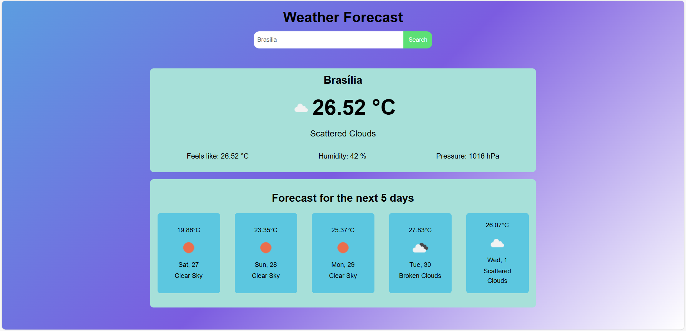

# 🌤️ React Weather Forecast ⛈️

## 🛠️ Project description
A responsive web application that displays the weather forecast for the current day and the next five days. The application also allows you to search for the weather forecast by city name.

The application was developed using the mobile-first methodology, integrating BEM and SMACSS methodologies, to be modularized and with well-organized CSS. This ensures a modular application not only in logic but also in style.

## 📐 Application features
- Fetches the user's coordinates based on the browser
- Makes an API call based on these coordinates
- Allows the user to search for a specific city by name
- Displays the current weather forecast
- Displays the weather forecast for the next 5 days

## 🌐 Access the Project
You can access the project by [clicking here](https://jordan-will.github.io/react-weather-forecast/).

## 💻 Technologies used
- Vite
- React.js
- Typescript
- SASS
- Axios
- OpenWeather API
- BEM
- SMACSS

## 👨‍ Author
| [ Jordan Willian](https://github.com/jordan-will) |
| :---: |

